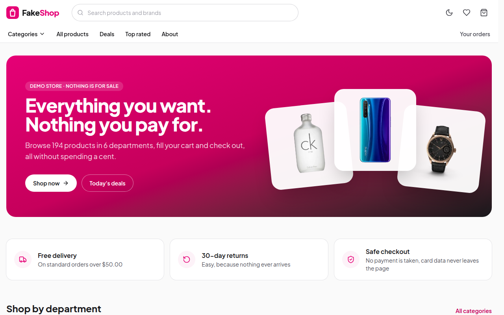
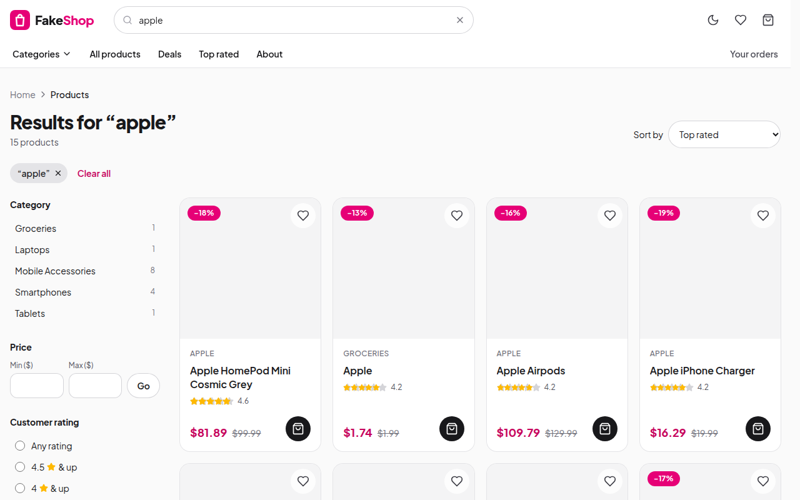
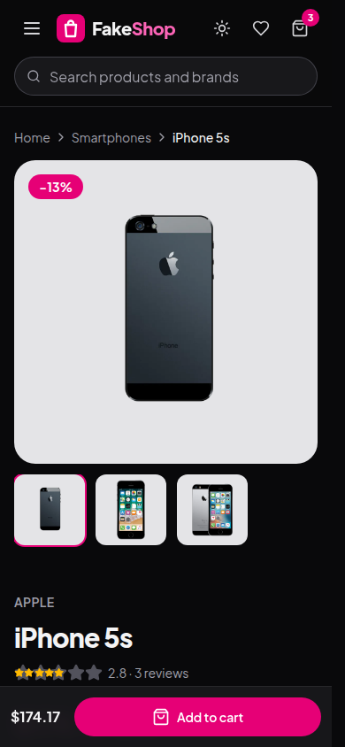
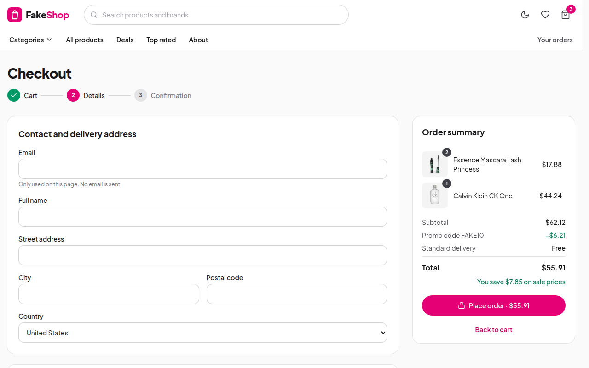

# FakeShop

[](https://github.com/AkosKappel/FakeShop/actions/workflows/deploy.yml)
[](LICENSE)


FakeShop is a demo online store: search and filter 194 products, save favourites, fill a cart and go through a full checkout. It looks real, but nothing is for sale: no payment is taken and nothing ships. Product data comes from the free [DummyJSON API](https://dummyjson.com/docs/products).

**Live demo:** https://akoskappel.github.io/FakeShop/



## Features

- Search by name, brand or category with suggestions, then filter by price, rating, brand, stock and sale, and sort by price, rating or discount. Filters, sorting and the page number live in the URL, so any list can be shared
- Product pages with an image gallery, zoom, stock status, shipping and return details, reviews and related products, plus a sticky add-to-cart bar on phones
- Cart with stock-aware quantities, undo on remove, promo codes (`FAKE10`, `FREESHIP`) and a free delivery threshold
- Checkout with browser autofill, card number checksum, expiry and security code checks, delivery dates in business days and a confirmation page. Card details are never stored; an order keeps only the last four digits
- Compare up to three products side by side, with the best price, rating and weight highlighted
- Optional demo sign-in with DummyJSON accounts: a route action signs in, the token is checked and expires after an hour, and checkout fills in the account's address
- Wishlist, recently viewed products and order history, saved in the browser and synced between open tabs
- Light and dark theme (following the system or chosen, without a flash on load), loading skeletons, the product image morphing from card to page (View Transitions API), toasts, error pages with retry and a 404 page, installable as an app
- Keyboard and screen reader friendly: labelled controls, native dialogs and popovers, focus moved to each new page (Lighthouse accessibility 100, checked in CI)

| Search with filters                         | On a phone, dark theme                                            |
| ------------------------------------------- | ----------------------------------------------------------------- |
|  |  |



## Tech stack

- [React 19](https://react.dev/) with TypeScript, built with [Vite](https://vite.dev/) as a static single-page app
- [React Router 8](https://reactrouter.com/) in data mode: route loaders and actions, lazy routes, error pages, view transitions, scroll restoration
- [Tailwind CSS 4](https://tailwindcss.com/) with the theme defined in CSS, [Lucide](https://lucide.dev/) icons through [react-icons](https://react-icons.github.io/react-icons/), a self-hosted font from [Fontsource](https://fontsource.org/)
- [React Hook Form](https://react-hook-form.com/) for the checkout
- [Vitest](https://vitest.dev/) unit tests, [Playwright](https://playwright.dev/) end-to-end tests with [axe](https://github.com/dequelabs/axe-core) accessibility checks, ESLint and Prettier
- GitHub Actions and GitHub Pages for CI and hosting

## How it works

- **Data:** the whole catalog (about 8 kB compressed) is fetched once with DummyJSON's `select` parameter and cached for the session. Search, filters, sorting and paging all run on it in the browser, so they are instant. Product pages load their details on demand and stream them in with Suspense, showing a skeleton meanwhile.
- **State:** cart, wishlist, comparison, recently viewed, orders, promo code, theme and the sign-in session are small stores (`src/lib/store.ts`) saved to `localStorage` and read with `useSyncExternalStore`. The `storage` event keeps every open tab in sync. Nothing is sent to a server, apart from signing in to DummyJSON.
- **Prices:** DummyJSON gives every product a discount; FakeShop shows discounts of 10% and more as sales and charges the list price otherwise.
- **Hosting:** GitHub Pages serves static files only, so the build copies `index.html` to `404.html` and links to any page (a product, a filtered search) still open the app.

## Getting started

Requires Node.js 24.

```bash
npm install
npm run dev
```

| Script               | What it does                                                    |
| -------------------- | --------------------------------------------------------------- |
| `npm run dev`        | Start the development server on http://localhost:5173/FakeShop/ |
| `npm run lint`       | Lint the code with ESLint                                       |
| `npm run typecheck`  | Type-check the project                                          |
| `npm test`           | Run the unit tests                                              |
| `npm run build`      | Type-check and build the static site into `dist`                |
| `npm run test:e2e`   | Run the end-to-end tests against the build                      |
| `npm run lighthouse` | Run Lighthouse on the build and check the score budget          |
| `npm run format`     | Format the code with Prettier (`format:check` only checks)      |

## Testing

- **Unit tests** (`src/lib/*.test.ts`, Vitest): prices and discounts, URL filters, search, sorting and paging, cart rules (stock limits, merging, undo, tab sync) and checkout rules (card checksum, expiry, delivery costs, promo codes, business days).
- **End-to-end tests** (`test/e2e`, Playwright): run on the production build in a desktop and a phone browser, with DummyJSON served from fixtures, so they are fast and stable. They cover search, filters, product pages, the cart with undo, promo codes, the full checkout (including a check that no card number reaches `localStorage`), the wishlist, comparison, demo sign-in (including a check that sensitive profile fields are not stored), tab sync, the theme, the mobile menu and 404 pages, with axe accessibility checks.
- **Lighthouse** (`lighthouserc.json`, Lighthouse CI): desktop runs on five pages. CI fails below 100 for accessibility, best practices and SEO, and below 85 for performance (it calls the live API); the reports are kept as a workflow artifact.

```bash
npm run build
npx playwright install chromium
npm run test:e2e
```

## Deployment

Every push and pull request runs [the workflow](.github/workflows/deploy.yml): format check, lint, type check, unit tests, build, end-to-end tests and the Lighthouse budget. Pushes to `main` then deploy `dist` to GitHub Pages.

## License

[MIT](LICENSE)
